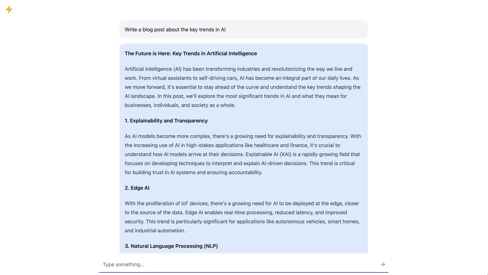

<h1 class="text-4xl">Faster.chat - Open Source Chat  🚀📝</h1>

<p></p><p>Tired of waiting on slow chat completions? [Faster.chat](https://faster.chat) is an open-source, blazingly fast chat UI powered by [Groq](https://www.groq.com/) and [Llama 3](https://ai.meta.com/blog/meta-llama-3/).  </p><p></p>



## 🌟 Features

- 🏃‍♂️ Lightning-fast response times
- 🔧 Easy setup and configuration
- 🌐 Powered by Groq & Llama 3

## 🛠️ Installation

1. Clone the repository:

   ```
   git clone https://github.com/lucasastorian/faster
   cd faster
   ```

2. Copy the example environment file:

   ```
   cp src/environments/environment.example.ts src/environments/environment.ts
   ```

3. Add your Groq API key to `src/environments/environment.ts`.

4. Install the required dependencies:

   ```
   npm install
   ```

5. Serve the application:

   ```
   ng serve -o
   ```

   The application will be available at `http://localhost:4200`.

## 🤝 Contributing

We welcome contributions from the community! If you'd like to contribute to faster.chat, please follow these steps:

1. Fork the repository.
2. Create a new branch for your feature or bug fix.
3. Make your changes and commit them with descriptive messages.
4. Push your changes to your forked repository.
5. Submit a pull request to the main repository.

Please ensure that your code adheres to our coding standards and includes appropriate tests.

## 📄 License

faster.chat is released under the [Apache 2.0 License](https://github.com/lucasastorian/faster/blob/main/LICENSE).

## 💡 Acknowledgements

- [Groq](https://www.groq.com/) for providing the high-performance cloud infrastructure.
- [Meta AI](https://ai.facebook.com/) for developing the Llama 3 language model.
- [Angular](https://angular.io/) for the powerful web development framework.

## 📧 Contact

If you have any questions, suggestions, or feedback, please feel free to reach out to us at [lucasastorian@gmail.com](mailto:lucasastorian@gmail.com).

Happy chatting! 😊